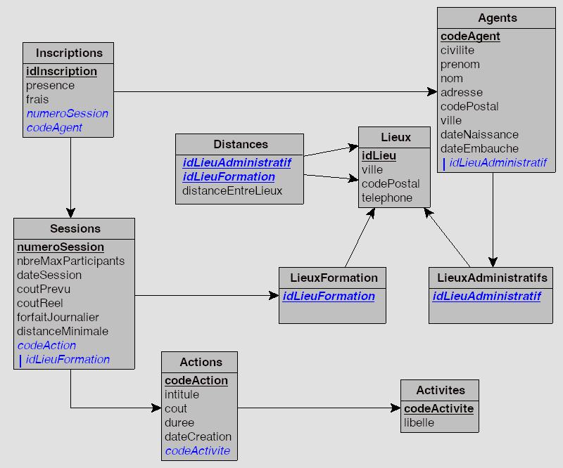

# Service formation


## Diagramme de classes

Au service Formation du personnel de la Direction Régionale de la SNCF de Bordeaux, toutes les données nécessaires à la gestion des formations sont enregistrées dans la base de données présentée ci-après.




```
    Actions.cout        : coût fixe estimé pour l'action par participant
    Sessions.coutPrevu  : montant estimé prévisionnel des frais d’hébergement
    Sessions.coutReel   : montant effectivement remboursé en frais d’hébergement
    Inscriptions.frais  : montant de la facture d’hébergement fournie
                            par un agent pour une session
```


## 1. Lecture et compréhension des requêtes SQL

Pour chacune des requêtes suivantes :
- formuler la demande d'information à laquelle elle répond,
- l'implanter sur le SGBD,
- contrôler que le résultat obtenu est conforme au besoin exprimé.


**Requête n°1 :**
```sql
SELECT nom, prenom, Lieux.ville
FROM Agents
      INNER JOIN Lieux
            ON Agents.idLieuAdministratif = Lieux.idLieu
ORDER BY Lieux.ville, nom;
```


**Requête n°2 :**
```sql
SELECT libelle
FROM Activites
WHERE codeActivite NOT IN ( SELECT codeActivite
                            FROM Actions
                                INNER JOIN Sessions
                                    ON Actions.codeAction = Sessions.codeAction
                            WHERE dateSession > '2005-12-11' )
```
*Remarque :* on remplacera 2005 par l’année en cours de la table Sessions.


**Requête n°3 :**
```sql
SELECT nom, prenom, distanceEntreLieux
FROM Agents
    INNER JOIN Inscriptions
            ON Agents.codeAgent = Inscriptions.codeAgent
        INNER JOIN Sessions
                ON Inscriptions.numeroSession = Sessions.numeroSession
            INNER JOIN Distances
					ON Sessions.idLieuFormation = Distances.idLieuFormation
                       AND Agents.idLieuAdministratif = Distances.idLieuAdministratif
WHERE distanceEntreLieux > 350;
```


**Requête n°4 :**
```sql
SELECT numeroSession, intitule
FROM Sessions
	INNER JOIN Actions
			ON Sessions.codeAction = Actions.codeAction
		INNER JOIN Lieux
				ON Sessions.idLieuFormation = Lieux.idLieu
AND ville = "Bordeaux";
```


**Requête n°5 :**
```sql
SELECT DISTINCT ville
FROM Lieux
	INNER JOIN LieuxFormation
			ON Lieux.idLieu = LieuxFormation.idLieuFormation
ORDER BY ville;
```


**Requête n°6 :**
```sql
SELECT COUNT(*) as nbrInscrits
FROM Inscriptions
	INNER JOIN Sessions
			ON Inscriptions.numeroSession = Sessions.numeroSession
		INNER JOIN Actions
				ON Sessions.codeAction = Actions.codeAction
			INNER JOIN Activites
					ON Actions.codeActivite = Activites.codeActivite
WHERE libelle = "Informatique";
```


**Requête n°7 :**
```sql
SELECT MIN(cout) AS coutMin
FROM Actions;
```


**Requête n°8 :**
```sql
SELECT intitule, AVG(coutPrevu - coutReel)
FROM Actions
	INNER JOIN Sessions
			ON Actions.codeAction = Sessions.codeAction
WHERE coutReel IS NOT NULL
GROUP BY intitule;
```


## 2. Lecture et modification de requêtes SQL incorrectes

**Dans chacun des cas suivants :**

- **expliquer en quoi cette requête n'est pas conforme à la demande**,
- **proposer une modification de la requête**,
- **exécuter et contrôler cette requête dans le SGBD.**


**Cas n° 1** : *Quel est l'intitulé et le coût des actions dont le coût est le plus faible ?*

La requête suivante a été construite :

```sql
SELECT intitule, MIN(cout) AS coutMin
FROM Actions
WHERE cout = (SELECT cout
              FROM Actions)
GROUP BY intitule;
```


**Cas n° 2** : *Quel est le nombre de sessions par activité ?*

La requête suivante a été construite :

```sql
SELECT libelle, intitule, COUNT(Sessions.numeroSession)
FROM Activites
	INNER JOIN Actions
			ON Activites.codeActivite = Actions.codeActivite
		INNER JOIN Sessions
				ON Actions.codeAction = Sessions.codeAction;
```


**Cas n°3** : *Quelle est la liste des intitulés d'actions pour lesquelles il y a plus de 3 inscrits, toutes sessions confondues ?*

La requête suivante a été construite :

```sql
SELECT intitule, COUNT(*) AS nbrInscrits
FROM Actions
	INNER JOIN Sessions
			ON Actions.codeAction = Sessions.codeAction
WHERE nbrInscrits > 3
GROUP BY intitule;
```


**Cas n°4** : *Quel est le montant total des frais d'hébergement par session ?*

La requête suivante a été construite :

```sql
SELECT numeroSession, COUNT(frais)
FROM Inscriptions
GROUP BY numeroSession;
```


## 3. Écriture de requêtes SQL

**Pour chacun des besoins exprimés suivants :**

- écrire et exécuter la requête correspondante,
- contrôler que le résultat obtenu soit conforme à la demande.


**R1 :** *Quelle est la liste des inscriptions (nom, prénom, numeroSession et dateSession) triée par nom et prénom ?*

**R2 :** *Quelle est la liste des actions d'une durée supérieure à 60 heures ?*

**R3 :** *Quelle est la liste des dates et des lieux de sessions dont le contenu concerne les « réseaux » ?*

**R4 :** *Quelle est la liste des agents qui ne sont inscrits à aucune session ?*

**R5 :** *Quelles sont les sessions par activité (libellé de l’activité, intitulé de l'action, date de session) ?*

**R6 :** *Quelle est la liste des agents déclarant des frais d'hébergement supérieurs à 1000 € ?*

**R7 :** *Quel est le nombre de sessions qui se déroulent à Bordeaux ?*

**R8 :** *Quelle est la liste des activités pour lesquelles le coût moyen des actions est inférieur à 3 000 € ?*

**R9 :** *Quelle est la liste de intitulés d'actions qui ont des sessions pour lesquelles le coût réel est supérieur au coût prévu, en affichant cet écart ?*

**R10 :** *Quel est le nombre total de places, toutes sessions confondues, portant sur l'activité "informatique" ?*

**R11 :** *Quel est le nombre total de places par action ?*

**R12 :** *Quelle est la durée moyenne des actions par activité ?*
