# Pizzeria
**Création d'une base de données à partir d'un modèle relationnel**

## 1. Création de la base de données avec insertion de données

Le but du travail est d'implémenter le Système d'information d'une pizzeria. Celui-ci gère la composition des pizzas, les commandes et les livraisons par des employés.

> **Travail à faire**
>
> Composer le script de création de base de donnée Pizzeria en utilisant les commandes SQL adéquates, à partir du modèle relationnel fourni.
>
> Compléter ensuite le script pour insérer les données nécessaires au fonctionnement du système de gestion de la pizzeria. Les principales données sont fournies ci-après. Les données nécessaires aux commandes sont à composer librement.

Cet exercice permet de :
- manipuler les commandes SQL de création de base, tables, champs, index, intégrité, données…,
- réfléchir à l'organisation des données dans les champs,
- visualiser les informations nécessaires aux jointures,
- se créer un jeux de données utile pour le test des requêtes.

### 1.1. Modèle relationnel de la base de données Pizzeria

- **Ingredients** (<u>idIngredient</u>, nomIngredient, prixUnitaireIngredient, #symboleUnite)
        idIngredient : Clef primaire
        symboleUnite : Clef étrangère en référence à symboleUnite de Unites
- **Unites** (<u>symboleUnite</u>, libelleUnite)
        symboleUnite : Clef primaire
- **Compositions** (<u>idComposition</u>, #idPizza, #idIngredient, quantite)
        idComposition : Clef primaire
        idPizza : Clef étrangère en référence à idPizza de Pizzas
        idIngredient : Clef étrangère en référence à idIngredient de Ingredients
- **Pizzas** (<u>idPizza</u>, nomPizza, prixVentePizza)
        idPizza : Clef primaire
- **LignesCommande** (<u>idLigneCommande</u>, #idPizza, #idCommande, quantite)
        idLigneCommande : Clef primaire
        idPizza : Clef étrangère en référence à idPizza de Pizzas
        idCommande : Clef étrangère en référence à idCommande de Commandes
- **Commandes** (<u>idCommande</u>, dateCommande, heureCommande, heureLivraison, #idEmploye)
        idCommande : Clef primaire
        idEmploye : Clef étrangère en référence à idEmploye de Employes
- **Employes** (<u>idEmploye</u>, nomEmploye, prenomEmploye, dateNaissance, salaireMensuel, dateEmbauche)
        idEmploye : Clef primaire

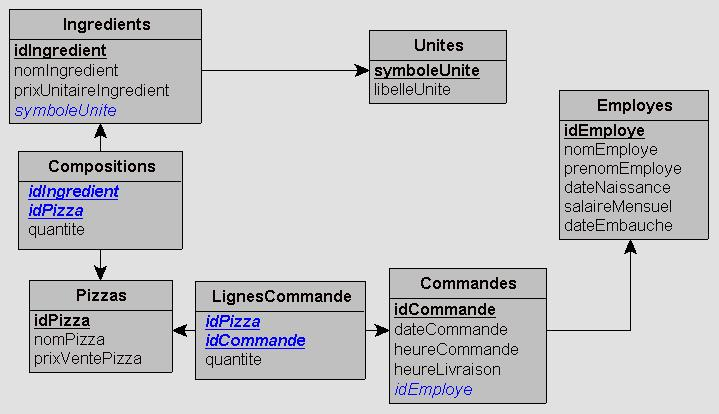

### 1.2. Les ingrédients

| **Ingrédients** | **Tarif** |
| --------------- | --------- |
| Sauce tomate    | 3 €/L     |
| Champignons     | 5 €/Kg    |
| Pâte à pizza    | 1 €/pâte  |
| Chorizo         | 7 €/Kg    |
| Emmental        | 4 €/Kg    |
| Roquefort       | 5 €/Kg    |
| Chèvre          | 6 €/Kg    |
| Mozzarella      | 5 €/Kg    |
| Parmesan        | 6 €/Kg    |
| Lardons         | 1,5 €/Kg  |
| Crème fraîche   | 2 €/L     |
| Oignons         | 1 €/Kg    |
| Olives noires   | 7,35 €/Kg |
| Jambon          | 2 €/Kg    |
| Ananas          | 1 €/Kg    |
| Olives vertes   | 6,20 €/Kg |

### 1.3. Les Pizzas proposées

Deux pizzas sont proposées, d'autres pourront être ajoutées.

| **La pizza 4 fromages à 14 €**  | **La pizza royale à 16 €** |
| ------------------------------- | -------------------------- |
| 1 pâte à pizza                  | 1 pâte à pizza             |
| 100 ml de sauce tomate          | 100 ml de sauce tomate     |
| 150 g de lardons                | 10 g d'oignon              |
| 130 ml de crème fraîche épaisse | 50 g de champignons        |
| 100 g de roquefort              | 25 g d'emmenthal râpé      |
| 130 g de chèvre                 | 30 g de mozzarella         |
| 80 g de mozzarella              | 40 g d'olives noires       |
| 30 g de parmesan                | 100 g de jambon            |

### 1.4. Les employés

- Julien MARTIN, embauché à 1 150 €/mois,
- Ludovic DURAND, embauché à 1 200 €/mois.

## 2. Requêtes

> **Travail à faire**
>
> Construire les requêtes suivantes. Adapter les données pour permettre la vérification du fonctionnement des différentes requêtes.

### 2.1. SQL standard

**R1** : *« Quelle est la liste des nom et prix de chaque pizza, triée par ordre de prix croissant ? »*
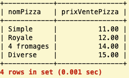

**R2** : *« Quel est le nom des pizzas qui coûtent plus de 13€, triés par ordre décroissant du prix ? »*

**R3** : *« Quelle est la liste de nom et prénom des employés qui gagnent entre 1 200 € et 1 300 € ? »*
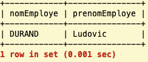

**R4** : *« Quel est l'identifiant des commandes passées courant de l’année 2011, entre 15h et 16h de l’après midi, qui n’ont pas été traitées par l’employé numéro 1 ? »*
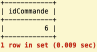

**R5** : *« Quel est le nom des ingrédients qui se terminent par la lettre « a » ? »*
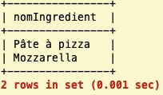

**R6** : *« Quelle est la liste des identifiants de pizzas qui contiennent au moins 100 g de champignons ou au moins 100 g de chorizo ? »*
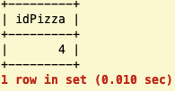

**R7** : *« Quelle est la liste avec nom et quantité des ingrédients de la pizza 4 fromages ? »*
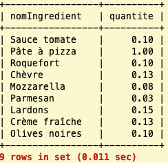

**R8** : *« Quels sont les noms des pizzas qui contiennent des olives ou du chorizo ? »*
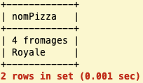

**R9** : *« Quel est le nom et prénom de l’employé qui a traité la commande 3 ? »*
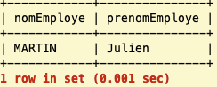

**R10** : *« Quels sont les noms des employés ayant livré les commandes du 23 juin 2011 ? »*
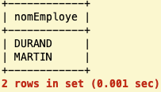

**R11** : *« Quels sont le ou les employés qui gagnent le plus ? »*
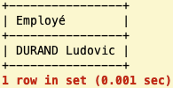

**R12** : *« Quels sont, sans doublon, les ingrédients nécessaires pour réaliser les pizzas de la commande 2 ? »*
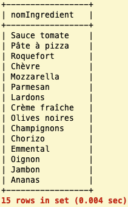

**R13** : *« Quels sont les ingrédients qui ne sont utilisés dans aucune pizza ? »*
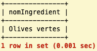

### 2.2. SQL avancé

**R14** : *« Quelle est la liste des commandes qui ont été livrées moins de 10 minutes après avoir été commandées ? »*
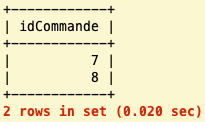

**R15** : *« Quel est la liste des commandes qui ont été commandées le mois de naissance de Julien MARTIN, en précisant le nom et le prénom des livreurs qui ont livrés chacune de ces commandes ? »*
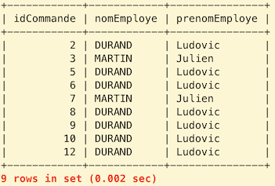

**R16** : *« Quels sont les noms des pizzas qui contiennent au moins un ingrédient en commun avec la 4 fromages, sauf la pâte ? »*
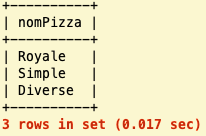

**R17** : *« Quelle est la listes des pizzas plus chères que la pizza royale ? »*
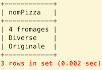

**R18** : *« Quelle est la liste des commandes livrées cette année, en précisant le nom et le prénom des livreurs qui ont livrés chacune de ces commandes ? »*
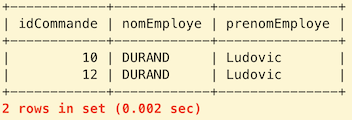

Illustration pour l'année 2020.

**R19** : *« Donner le contenu de chaque commande, en précisant le nom de la pizza et la quantité. »*
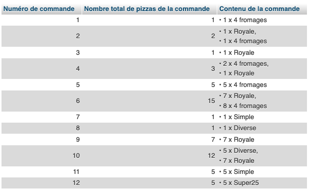

**R20** : *« Quelles sont les commandes qui ne contiennent pas de pizza 4 fromages ? »*
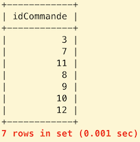

**R21** : *« Quelles sont les pizzas qui ne contiennent pas de chorizo ? »*
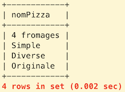

**R22** : *« Quelles sont les pizzas qui ne contiennent pas de chorizo et qui ont été livrées dans au moins une commande du 23 juin 2011 ? »*
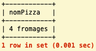

**R23** : *« Quels sont les employés (nom et prénom) qui ont livrés plus de 2 commandes le 23 juin 2011 entre 16h et 17h ? »*
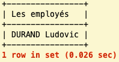

**R24** : *« Quelles sont la ou les pizzas qui contiennent le moins de chorizo, mais en contiennent, en précisant combien elles en contiennent ? »*
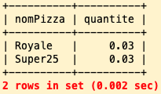

**R25** : *« Quelles sont les pizzas ayant été livrées par le livreur de la commande 12, qui contiennent au moins autant de chorizo que la pizza Royale et qui coûtent moins de 13 € ? »*
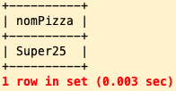

**R26** : *« Quelles sont la ou les pizzas qui contiennent le plus d’ingrédients ? »*
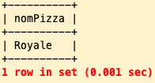

**R27** : *« Afficher la liste des pizzas avec une 2e colonne indiquant selon la quantité de champignons le message "Plus de 100g", "Moins de 100g" ou "Aucun". »*
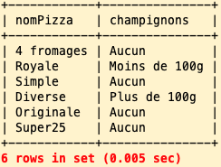

