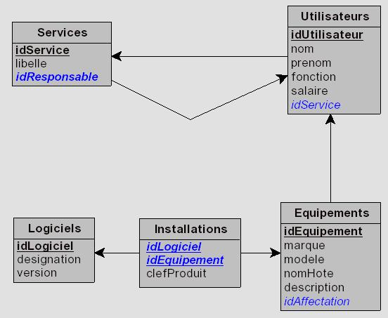

# Gestion de parc informatique
**Création d'une base de données à partir d'un modèle relationnel**

## 1. Création de la base de données avec insertion de données

Le but du travail est d'implémenter le Système d'information d'une gestion de parc informatique. Celui-ci gère les utilisateurs, leur service et l'installation des logiciels sur les équipements.

> **Travail à faire**
>
> Composer le script de création de base de donnée Gestion de parc informatique en utilisant les commandes SQL adéquates, à partir du modèle relationnel fourni.
>
> Compléter le script pour insérer les données nécessaires au fonctionnement. Les principales données sont fournies ci-après.

### 1.1. Modèle relationnel de la base de données

- **Services** (<u>idService</u>, libelle, #idResponsable)
        idService : clef primaire
        idResponsable : clef étrangère en référence à idUtilisateur de Utilisateurs

- **Utilisateurs** (<u>idUtilisateur</u>, nom, prenom, fonction, salaire, #idService)
        idUtilisateur : clef primaire
        idService : clef étrangère en référence à idService de Services

- **Logiciels** (<u>idLogiciel</u>, designation, version)
        idLogiciel : clef primaire

- **Equipements** (<u>idEquipement</u>, marque, modele, nomHote, description, #idAffectation)
        idEquipement : clef primaire
        idAffectation : clef étrangère en référence à idUtilisateur de Utilisateurs

- **Installations** (<u>#idEquipement, #idLogiciel</u>, clefProduit)
        idEquipement, idLogiciel : clef primaire
        idEquipement : clef étrangère en référence à idEquipement de Equipements
        idLogiciel : clef étrangère en référence à idLogiciel de Logiciels

### 1.2. Exemples de données

Les trois tableaux suivants constituent en réalité un seul tableau unique pour lequel chaque ligne se correspond. Il a été découpé en trois blocs pour une question de lisibilité, blocs qui sont donnés ici l'un en dessous de l'autre. Ce tableau est le résultat de la requête activant toutes les jointures possibles entre toutes les tables.

<table style='border: 1px solid #a9a9a9;'>
    <thead>
        <tr>
            <th style='border: 1px solid #a9a9a9; text-align:center; background-color: #c2d69a;'>Services</th>
            <th colspan='4' style='border: 1px solid #a9a9a9; text-align:center; background-color: #c2d69a;'>Utilisateurs</th>
        </tr>
        <tr>
            <th style='border: 1px solid #a9a9a9; text-align:left; background-color: #ccc0da;'>Libellé</th>
            <th style='border: 1px solid #a9a9a9; text-align:left; background-color: #ccc0da;'>Nom</th>
            <th style='border: 1px solid #a9a9a9; text-align:left; background-color: #ccc0da;'>Prénom</th>
            <th style='border: 1px solid #a9a9a9; text-align:left; background-color: #ccc0da;'>Fonction</th>
            <th style='border: 1px solid #a9a9a9; text-align:left; background-color: #ccc0da;'>Salaire</th>
        </tr>
    </thead>
    <tbody>
        <tr>
            <td style='border: 1px solid #a9a9a9; text-align:left; background-color: #c5d9f1;'>Comptabilité</td>
            <td style='border: 1px solid #a9a9a9; text-align:left; background-color: #c5d9f1;'>SIMON</td>
            <td style='border: 1px solid #a9a9a9; text-align:left; background-color: #c5d9f1;'>Paul</td>
            <td style='border: 1px solid #a9a9a9; text-align:left; background-color: #c5d9f1;'>Adjoint</td>
            <td style='border: 1px solid #a9a9a9; text-align:left; background-color: #c5d9f1;'>1 600 €</td>
        </tr>
        <tr>
            <td style='border: 1px solid #a9a9a9; text-align:left; background-color: #c5d9f1;'>Comptabilité</td>
            <td style='border: 1px solid #a9a9a9; text-align:left; background-color: #c5d9f1;'>SIMON</td>
            <td style='border: 1px solid #a9a9a9; text-align:left; background-color: #c5d9f1;'>Paul</td>
            <td style='border: 1px solid #a9a9a9; text-align:left; background-color: #c5d9f1;'>Adjoint</td>
            <td style='border: 1px solid #a9a9a9; text-align:left; background-color: #c5d9f1;'>1 600 €</td>
        </tr>
        <tr>
            <td style='border: 1px solid #a9a9a9; text-align:left; background-color: #c5d9f1;'>Comptabilité</td>
            <td style='border: 1px solid #a9a9a9; text-align:left; background-color: #c5d9f1;'>DUPOND</td>
            <td style='border: 1px solid #a9a9a9; text-align:left; background-color: #c5d9f1;'>Gérard</td>
            <td style='border: 1px solid #a9a9a9; text-align:left; background-color: #c5d9f1;'>Chef</td>
            <td style='border: 1px solid #a9a9a9; text-align:left; background-color: #c5d9f1;'>2 200 €</td>
        </tr>
        <tr>
            <td style='border: 1px solid #a9a9a9; text-align:left; background-color: #c5d9f1;'>Comptabilité</td>
            <td style='border: 1px solid #a9a9a9; text-align:left; background-color: #c5d9f1;'>DUPOND</td>
            <td style='border: 1px solid #a9a9a9; text-align:left; background-color: #c5d9f1;'>Gérard</td>
            <td style='border: 1px solid #a9a9a9; text-align:left; background-color: #c5d9f1;'>Chef</td>
            <td style='border: 1px solid #a9a9a9; text-align:left; background-color: #c5d9f1;'>2 200 €</td>
        </tr>
        <tr>
            <td style='border: 1px solid #a9a9a9; text-align:left; background-color: #fbff00;'>R&D</td>
            <td style='border: 1px solid #a9a9a9; text-align:left; background-color: #fbff00;'>BLABLA</td>
            <td style='border: 1px solid #a9a9a9; text-align:left; background-color: #fbff00;'>Alexandre</td>
            <td style='border: 1px solid #a9a9a9; text-align:left; background-color: #fbff00;'>Technicien</td>
            <td style='border: 1px solid #a9a9a9; text-align:left; background-color: #fbff00;'>2 000 €</td>
        </tr>
        <tr>
            <td style='border: 1px solid #a9a9a9; text-align:left; background-color: #fbff00;'>R&D</td>
            <td style='border: 1px solid #a9a9a9; text-align:left; background-color: #fbff00;'>COUCOU</td>
            <td style='border: 1px solid #a9a9a9; text-align:left; background-color: #fbff00;'>Robert</td>
            <td style='border: 1px solid #a9a9a9; text-align:left; background-color: #fbff00;'>Chef</td>
            <td style='border: 1px solid #a9a9a9; text-align:left; background-color: #fbff00;'>2 700 €</td>
        </tr>
        <tr>
            <td style='border: 1px solid #a9a9a9; text-align:left; background-color: #fbff00;'>R&D</td>
            <td style='border: 1px solid #a9a9a9; text-align:left; background-color: #fbff00;'>COUCOU</td>
            <td style='border: 1px solid #a9a9a9; text-align:left; background-color: #fbff00;'>Robert</td>
            <td style='border: 1px solid #a9a9a9; text-align:left; background-color: #fbff00;'>Chef</td>
            <td style='border: 1px solid #a9a9a9; text-align:left; background-color: #fbff00;'>2 700 €</td>
        </tr>
        <tr>
            <td style='border: 1px solid #a9a9a9; text-align:left; background-color: #fbff00;'>R&D</td>
            <td style='border: 1px solid #a9a9a9; text-align:left; background-color: #fbff00;'>COUCOU</td>
            <td style='border: 1px solid #a9a9a9; text-align:left; background-color: #fbff00;'>Robert</td>
            <td style='border: 1px solid #a9a9a9; text-align:left; background-color: #fbff00;'>Chef</td>
            <td style='border: 1px solid #a9a9a9; text-align:left; background-color: #fbff00;'>2 700 €</td>
        </tr>
    </tbody>
</table>
<table style='border: 1px solid #a9a9a9;'>
    <thead>
        <tr>
            <th style='border: 1px solid #a9a9a9; text-align:center; background-color: #c2d69a;'>Services</th>
            <th colspan='4' style='border: 1px solid #a9a9a9; text-align:center; background-color: #c2d69a;'>Équipements</th>
        </tr>
        <tr>
            <th style='border: 1px solid #a9a9a9; text-align:left; background-color: #ccc0da;'>Libellé</th>
            <th style='border: 1px solid #a9a9a9; text-align:left; background-color: #ccc0da;'>Marque</th>
            <th style='border: 1px solid #a9a9a9; text-align:left; background-color: #ccc0da;'>Modèle</th>
            <th style='border: 1px solid #a9a9a9; text-align:left; background-color: #ccc0da;'>Nom d'hôte</th>
            <th style='border: 1px solid #a9a9a9; text-align:left; background-color: #ccc0da;'>Description</th>
        </tr>
    </thead>
    <tbody>
        <tr>
            <td style='border: 1px solid #a9a9a9; text-align:left; background-color: #c5d9f1;'>Comptabilité</td>
            <td style='border: 1px solid #a9a9a9; text-align:left; background-color: #c5d9f1;'>DELL</td>
            <td style='border: 1px solid #a9a9a9; text-align:left; background-color: #c5d9f1;'>Optiplex 740</td>
            <td style='border: 1px solid #a9a9a9; text-align:left; background-color: #c5d9f1;'>Compta-01</td>
            <td style='border: 1px solid #a9a9a9; text-align:left; background-color: #c5d9f1;'>2 Go RAM + 540 Go DD</td>
        </tr>
        <tr>
            <td style='border: 1px solid #a9a9a9; text-align:left; background-color: #c5d9f1;'>Comptabilité</td>
            <td style='border: 1px solid #a9a9a9; text-align:left; background-color: #c5d9f1;'>EPSON</td>
            <td style='border: 1px solid #a9a9a9; text-align:left; background-color: #c5d9f1;'>Stylus 260</td>
            <td style='border: 1px solid #a9a9a9; text-align:left; background-color: #c5d9f1;'>Compta-imp-01</td>
            <td style='border: 1px solid #a9a9a9; text-align:left; background-color: #c5d9f1;'>Laser couleur</td>
        </tr>
        <tr>
            <td style='border: 1px solid #a9a9a9; text-align:left; background-color: #c5d9f1;'>Comptabilité</td>
            <td style='border: 1px solid #a9a9a9; text-align:left; background-color: #c5d9f1;'>DELL</td>
            <td style='border: 1px solid #a9a9a9; text-align:left; background-color: #c5d9f1;'>Optiplex 680</td>
            <td style='border: 1px solid #a9a9a9; text-align:left; background-color: #c5d9f1;'>Compta-02</td>
            <td style='border: 1px solid #a9a9a9; text-align:left; background-color: #c5d9f1;'>4 Go RAM + 540 Go DD</td>
        </tr>
        <tr>
            <td style='border: 1px solid #a9a9a9; text-align:left; background-color: #c5d9f1;'>Comptabilité</td>
            <td style='border: 1px solid #a9a9a9; text-align:left; background-color: #c5d9f1;'>DELL</td>
            <td style='border: 1px solid #a9a9a9; text-align:left; background-color: #c5d9f1;'>Optiplex 680</td>
            <td style='border: 1px solid #a9a9a9; text-align:left; background-color: #c5d9f1;'>Compta-02</td>
            <td style='border: 1px solid #a9a9a9; text-align:left; background-color: #c5d9f1;'>4 Go RAM + 540 Go DD</td>
        </tr>
        <tr>
            <td style='border: 1px solid #a9a9a9; text-align:left; background-color: #fbff00;'>R&D</td>
            <td style='border: 1px solid #a9a9a9; text-align:left; background-color: #fbff00;'>DELL</td>
            <td style='border: 1px solid #a9a9a9; text-align:left; background-color: #fbff00;'>Optiplex 680</td>
            <td style='border: 1px solid #a9a9a9; text-align:left; background-color: #fbff00;'>RD-01</td>
            <td style='border: 1px solid #a9a9a9; text-align:left; background-color: #fbff00;'>6 Go RAM + 1 To DD</td>
        </tr>
        <tr>
            <td style='border: 1px solid #a9a9a9; text-align:left; background-color: #fbff00;'>R&D</td>
            <td style='border: 1px solid #a9a9a9; text-align:left; background-color: #fbff00;'>DELL</td>
            <td style='border: 1px solid #a9a9a9; text-align:left; background-color: #fbff00;'>Optiplex 740</td>
            <td style='border: 1px solid #a9a9a9; text-align:left; background-color: #fbff00;'>RD-02</td>
            <td style='border: 1px solid #a9a9a9; text-align:left; background-color: #fbff00;'>2 Go RAM + 540 Go DD</td>
        </tr>
        <tr>
            <td style='border: 1px solid #a9a9a9; text-align:left; background-color: #fbff00;'>R&D</td>
            <td style='border: 1px solid #a9a9a9; text-align:left; background-color: #fbff00;'>HPL</td>
            <td style='border: 1px solid #a9a9a9; text-align:left; background-color: #fbff00;'>Deskjet 650</td>
            <td style='border: 1px solid #a9a9a9; text-align:left; background-color: #fbff00;'>RD-imp-02</td>
            <td style='border: 1px solid #a9a9a9; text-align:left; background-color: #fbff00;'>Jet d'encre N&B</td>
        </tr>
        <tr>
            <td style='border: 1px solid #a9a9a9; text-align:left; background-color: #fbff00;'>R&D</td>
            <td style='border: 1px solid #a9a9a9; text-align:left; background-color: #fbff00;'>DELL</td>
            <td style='border: 1px solid #a9a9a9; text-align:left; background-color: #fbff00;'>Optiplex 740</td>
            <td style='border: 1px solid #a9a9a9; text-align:left; background-color: #fbff00;'>RD-02</td>
            <td style='border: 1px solid #a9a9a9; text-align:left; background-color: #fbff00;'>2 Go RAM + 540 Go DD</td>
        </tr>
    </tbody>
</table>

<table style='border: 1px solid #a9a9a9;'>
    <thead>
        <tr>
            <th style='border: 1px solid #a9a9a9; text-align:center; background-color: #c2d69a;'>Services</th>
            <th colspan='3' style='border: 1px solid #a9a9a9; text-align:center; background-color: #c2d69a;'>Logiciels</th>
        </tr>
        <tr>
            <th style='border: 1px solid #a9a9a9; text-align:left; background-color: #ccc0da;'>Libellé</th>
            <th style='border: 1px solid #a9a9a9; text-align:left; background-color: #ccc0da;'>Désignation</th>
            <th style='border: 1px solid #a9a9a9; text-align:left; background-color: #ccc0da;'>Version</th>
            <th style='border: 1px solid #a9a9a9; text-align:left; background-color: #ccc0da;'>Clef produit</th>
        </tr>
    </thead>
    <tbody>
        <tr>
            <td style='border: 1px solid #a9a9a9; text-align:left; background-color: #c5d9f1;'>Comptabilité</td>
            <td style='border: 1px solid #a9a9a9; text-align:left; background-color: #c5d9f1;'>Windows Seven</td>
            <td style='border: 1px solid #a9a9a9; text-align:left; background-color: #c5d9f1;'>W7 64 bits</td>
            <td style='border: 1px solid #a9a9a9; text-align:left; background-color: #c5d9f1;'>RTEYU-HFGJH-SRDRQ-PLKHG</td>
        </tr>
        <tr>
            <td style='border: 1px solid #a9a9a9; text-align:left; background-color: #c5d9f1;'>Comptabilité</td>
            <td style='border: 1px solid #a9a9a9; text-align:left; background-color: #c5d9f1;'></td>
            <td style='border: 1px solid #a9a9a9; text-align:left; background-color: #c5d9f1;'></td>
            <td style='border: 1px solid #a9a9a9; text-align:left; background-color: #c5d9f1;'></td>
        </tr>
        <tr>
            <td style='border: 1px solid #a9a9a9; text-align:left; background-color: #c5d9f1;'>Comptabilité</td>
            <td style='border: 1px solid #a9a9a9; text-align:left; background-color: #c5d9f1;'>Windows Seven</td>
            <td style='border: 1px solid #a9a9a9; text-align:left; background-color: #c5d9f1;'>W7 64 bits</td>
            <td style='border: 1px solid #a9a9a9; text-align:left; background-color: #c5d9f1;'>SRDRG-HFGJH-SRDRQ-PLKHG</td>
        </tr>
        <tr>
            <td style='border: 1px solid #a9a9a9; text-align:left; background-color: #c5d9f1;'>Comptabilité</td>
            <td style='border: 1px solid #a9a9a9; text-align:left; background-color: #c5d9f1;'>Pack Office</td>
            <td style='border: 1px solid #a9a9a9; text-align:left; background-color: #c5d9f1;'>Office 2007</td>
            <td style='border: 1px solid #a9a9a9; text-align:left; background-color: #c5d9f1;'>SRDRG-HFGJH-DESQI-PLHHG</td>
        </tr>
        <tr>
            <td style='border: 1px solid #a9a9a9; text-align:left; background-color: #fbff00;'>R&D</td>
            <td style='border: 1px solid #a9a9a9; text-align:left; background-color: #fbff00;'>Windows XP</td>
            <td style='border: 1px solid #a9a9a9; text-align:left; background-color: #fbff00;'>SP3 32 bits</td>
            <td style='border: 1px solid #a9a9a9; text-align:left; background-color: #fbff00;'>SHUZD-SLUGT-SARGT-TYUAS</td>
        </tr>
        <tr>
            <td style='border: 1px solid #a9a9a9; text-align:left; background-color: #fbff00;'>R&D</td>
            <td style='border: 1px solid #a9a9a9; text-align:left; background-color: #fbff00;'>Windows Seven</td>
            <td style='border: 1px solid #a9a9a9; text-align:left; background-color: #fbff00;'>W7 32 bits</td>
            <td style='border: 1px solid #a9a9a9; text-align:left; background-color: #fbff00;'>QPOBD-TDGBS-IUAZG-GSBUQ</td>
        </tr>
        <tr>
            <td style='border: 1px solid #a9a9a9; text-align:left; background-color: #fbff00;'>R&D</td>
            <td style='border: 1px solid #a9a9a9; text-align:left; background-color: #fbff00;'></td>
            <td style='border: 1px solid #a9a9a9; text-align:left; background-color: #fbff00;'></td>
            <td style='border: 1px solid #a9a9a9; text-align:left; background-color: #fbff00;'></td>
        </tr>
        <tr>
            <td style='border: 1px solid #a9a9a9; text-align:left; background-color: #fbff00;'>R&D</td>
            <td style='border: 1px solid #a9a9a9; text-align:left; background-color: #fbff00;'>Pack Office</td>
            <td style='border: 1px solid #a9a9a9; text-align:left; background-color: #fbff00;'>Office 2007</td>
            <td style='border: 1px solid #a9a9a9; text-align:left; background-color: #fbff00;'>SRDRQ-HFGJH-DESQI-PLKHG</td>
        </tr>
    </tbody>
</table>

## 2. Requêtes

> **Travail à faire**
>
> Construire les requêtes suivantes. Adapter les données pour permettre la vérification du fonctionnement des différentes requêtes.

### 2.1. Correction et insertion de données

**R1** : *Il y a eu une erreur dans le nom de Gérard DUPOND. Son nom réel est Gérard DUPONT.*

**R2** : *Louisette COUCOU, l'épouse du chef du service R&D a été embauchée et a été affectée à un poste identique à celui de Gérard DUPONT. Elle est embauchée avec un salaire inférieur de 150 € par rapport à celui de son mari.*

**R3** : *Tous les adjoints sont augmentés de 8%.*

**R4** : *Tous les employés touchant moins de 1000€ par mois doivent être licenciés.*

### 2.2. Interrogations

**R5** : *« Quelle est la liste des équipements (marque et modèle), sans doublon ? »*

**R6** : *« Quel sont les équipements du service Comptabilité ? »*

**R7** : *« Quel sont les employés des différents services triés par ordre alphabétique de nom, puis prénom ? »*

**R8** : *« Quel est le coût salarial mensuel cumulé de l'ensemble des employés (estimation du coût salarial à partir du salaire net) ? »*

**R9** : *« Quel est le salaire net moyen de chaque service ainsi que le nombre de personnes qui lui sont affectées ? »*

**R10** : *« Qui n'a pas de Pack Office ? »*

**R11** : *« Quels sont le ou les services où il y a le plus d’employés ? »*

**R12** : *« Afficher le tableau des données tel que fourni dans le sujet. »*

**R13** : *« Modifier la requête précédente pour afficher le tableau de toutes les données présentes dans la base de données. »*
