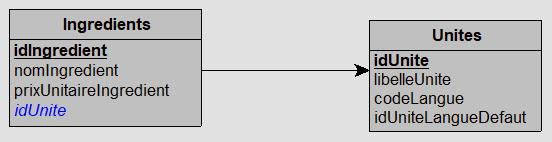

# Triggers et procédures stockées, application


------

Création : 24/02/2023 - F. SCHOSSIG
Modification : 10/12/2024 - F. SCHOSSIG

------


[TOC]


<div style="page-break-after:always"></div>
La syntaxe présentée ici est celle de MariaDB et peut donc différer de celle d'autres gestionnaires de bases de données.
La référence principale est la documentation de MariaDB Serveur :
https://mariadb.com/kb/en/documentation/


## 7. Application


### 7.1. Pizzeria : heure de livraison invalide

Apporter une modification à la base pizzeria afin d'interdire la saisie d'une heure de livraison précédent l'heure de commande.


### 7.2. Pizzeria : traduction des unités

Modifier la base Pizzeria afin de permettre la gestion des traductions des unités :
- renommer le champ symboleUnite en idUnite de type entier dans les tables `Ingredients` et `Unites`,
- ajouter un champ codeLangue pour préciser la langue de l'enregistrement : 'fr', 'de' ou 'en',
- ajouter un champ idUniteLangueDefaut pour relier une traduction à sa langue par défaut.

Ajouter les enregistrements nécessaires pour le fonctionnement.
Grace à une procédure ou fonction stockée, afficher la liste des ingrédients avec l'unité dans une autre langue.




<div style="page-break-after:always"></div>
### 7.3. Import de données

Le but de l'exercice est de réaliser un import automatique de données.
Les données à importer seront insérées dans un champ de type `JSON` d'une table d'import.
Un trigger positionné sur cette table va extraire les données du format Json pour les insérer chacune dans son champ situé dans les tables correspondantes, en modèle relationnel.


#### 7.3.1. Exemple

Afin de comprendre le principe, un exemple fonctionnel d'un import simple des nom et prénom de contacts vers une seule table est proposé ci-dessous.

**Script de création de la base, avec définition du trigger**
```sql
-- --------------------------------------------------------------------------------------
-- Base de données : contacts
--
DROP DATABASE
    IF EXISTS contacts;
CREATE DATABASE contacts
    DEFAULT CHARACTER SET utf8mb4
    COLLATE utf8mb4_general_ci;
USE contacts;
--
-- --------------------------------------------------------------------------------------
-- Structure de la table Contacts
--
CREATE TABLE Contacts (
    idContact INT(11) NOT NULL AUTO_INCREMENT,
    nomContact VARCHAR(30) DEFAULT '',
    prenomContact VARCHAR(30) DEFAULT '',
    PRIMARY KEY (idContact)
) ENGINE=InnoDB DEFAULT CHARSET=utf8mb4;
--
-- --------------------------------------------------------------------------------------
-- Structure de la table Imports
--
CREATE TABLE Imports (
    idImport INT(11) NOT NULL AUTO_INCREMENT,
    contactJson JSON NOT NULL CHECK (JSON_VALID(contactJson)),
    importFini BOOLEAN DEFAULT FALSE,
    PRIMARY KEY (idImport)
) ENGINE=InnoDB DEFAULT CHARSET=utf8mb4;
--
```
<div style="page-break-after:always"></div>
```sql
-- --------------------------------------------------------------------------------------
-- Création du trigger
--
DELIMITER |
CREATE OR REPLACE TRIGGER importsBeforeInsert BEFORE INSERT
ON Imports FOR EACH ROW
BEGIN
    INSERT INTO Contacts (nomContact, prenomContact) VALUES
        (JSON_VALUE(NEW.contactJson, '$.firstName'),
         JSON_VALUE(NEW.contactJson, '$.lastName'));
    SET NEW.importFini = TRUE;
END |
DELIMITER ;
-- --------------------------------------------------------------------------------------
```

**Import des données**

```sql
INSERT INTO Imports (contactJson) VALUES
    ('{"firstName":"Tom","lastName":"JACKSON"}'),
    ('{"firstName":"Ben","lastName":"BENSON"}'),
    ('{"firstName":"Tim","lastName":"RUBSAN"}');
```


<div style="page-break-after:always"></div>
#### 7.3.2. Import sur plusieurs tables

En s'inspirant de l'exemple, créer la base de données nécessaire pour l'import des données incluses dans les cinq blocs au format Json suivants :

```json
{   "nomClasse":"Classe 2B",
    "annee":2023,
    "active":true,
    "enseignant":{"prenom":"Richard", "nom":"ROE"},
    "membres":[{"prenom":"Jane","nom":"DOE"},
               {"prenom":"Jinny","nom":"ROE"},
               {"prenom":"Johnny","nom":"ROE"}]}
{   "nomClasse":"Classe 2C",
    "annee":2021,
    "active":true,
    "enseignant":{"prenom":"Arthur", "nom":"GRUE"},
    "membres":[{"prenom":"Jane","nom":"GOE"},
               {"prenom":"Annie","nom":"GRUOE"},
               {"prenom":"Albert","nom":"GHIOE"}]}
{   "nomClasse":"Classe 2A",
    "annee":2024,
    "active":true,
    "enseignant":{"prenom":"Lion", "nom":"MOUI"},
    "membres":[{"prenom":"Fifi","nom":"MAER"},
               {"prenom":"Junon","nom":"MNOU"},
               {"prenom":"John","nom":"MYEIT"}]}
{   "nomClasse":"Classe 1A",
    "annee":2020,
    "active":true,
    "enseignant":{"prenom":"Lulu", "nom":"MOUI"},
    "membres":[{"prenom":"Fifi","nom":"TUTU"},
               {"prenom":"Riri","nom":"TOTO"},
               {"prenom":"John","nom":"MYEIT"}]}
{   "nomClasse":"Classe 1B",
    "annee":2021,
    "active":true,
    "enseignant":{"prenom":"Fifi", "nom":"TUTU"},
    "membres":[{"prenom":"Annie","nom":"GRUOE"},
               {"prenom":"Junon","nom":"MNOU"},
               {"prenom":"John","nom":"MYEIT"}]}
```