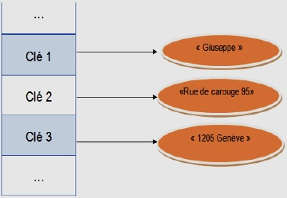
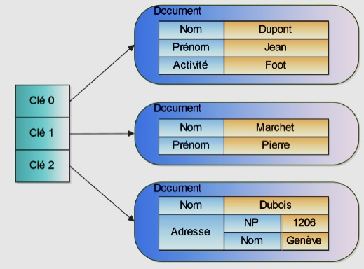
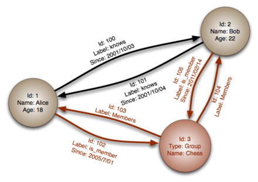
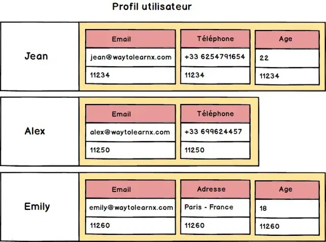
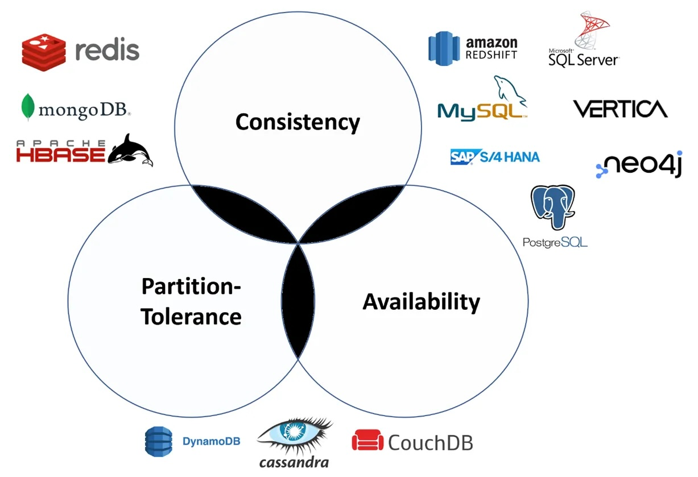

# NoSQL

[TOC]

## 1. Origine des bases NoSQL

Les SGBD relationnels créés dans les années 1970 se sont progressivement imposés jusqu'à devenir le paradigme de bases de données très largement dominant au début des années 1990. D'autres modèles de bases de données ont existé, tels les SGBD hiérarchiques, SGBD orientés objet, SGBD relationnel-objet mais leur utilisation est restée très limitée.

Dans le courant des années 2000 avec le développement de grandes entreprises internet brassant des quantités énormes de données et le développement de l'informatique en grappes, la domination sans partage du modèle relationnel a été remise en question : il souffrait de limites rédhibitoires pour ces nouvelles pratiques.

Ainsi, les grandes entreprises du web ont été les premières confrontées aux limitations intrinsèques des SGBD relationnels traditionnels. Ces systèmes sont fondés sur une application stricte des **propriétés ACID** et généralement **dimensionnés verticalement**. Leur entière performance repose sur un seul et même serveur. Pour augmenter leur capacité, il faut investir dans un serveur plus puissant. Ils posent ainsi des problèmes d'extensibilité.

Afin de répondre à ces limites, les entreprises du web ont commencé à développer leurs propres systèmes de gestion de bases de données. Ces systèmes peuvent fonctionner sur des architectures matérielles distribuées et permettent de traiter des volumes de données importants. Les systèmes propriétaires qui en ont résulté, certains encore utilisés aujourd'hui, ont été les précurseurs d'un nouveau modèle :

- **Google** avec BigTable,
- **Amazon** avec DynamoDB, 
- **LinkedIn** avec Voldemort,
- **Facebook** avec Cassandra puis HBase,
- **SourceForge** avec MongoDB,
- **Ubuntu One** avec CouchDB.

Une nouvelle alternative est ainsi née du développement de ces bases de données. La parution d'articles présentant ces systèmes propriétaires a conduit au développement de **systèmes évolutifs par architectures matérielles distribuées** et ne visant pas une **application stricte du standard ACID**.

Le terme **NoSQL** a été retenu pour désigner ces nouveaux systèmes « open-source, distribués et non-relationnels. » Le nom peut sembler comme une opposition aux bases de données SQL, mais sa fonction première n'était pas de remplacer les bases de données relationnelles, mais de proposer une alternative. L'interprétation « **not only SQL** » ne sera inventée que plus tard comme rétro-acronyme, pour souligner que ce modèle de base de données ne s'oppose pas au modèle relationnel, mais qu'il se veut **enrichissement** et **complément utile des bases de données SQL**. Les deux modèles peuvent aussi être utilisées conjointement.

Les bases de données NoSQL n’exploitent **pas de schéma de table fixe** dans lequel les données sont définies avant l’enregistrement. Elles utilisent des méthodes leur permettant d’enregistrer de nouveaux jeux de données et d’assurer leur mise à jour en continu au sein de l’application. Elles sont également adaptées au traitement de données non structurées ou inconnues.

 Les bases de données NoSQL sont **dimensionnées horizontalement** : les solutions NoSQL répartissent généralement leurs données sur plusieurs serveurs. En cas d’augmentation du volume de données, de **nouveaux serveurs** peuvent alors être **ajoutés**. Les bases de données NoSQL peuvent ainsi enregistrer et traiter sans problème de gros volumes de données. Elles sont donc particulièrement adaptées aux applications pour le Big Data.

## 2. Les quatre principales approches NoSQL

Il n'existe pas de règlementation uniforme des bases NoSQL. Mais à l'usage quatre catégories principales peuvent être définies :
- les bases de données orientées clef-valeur,
- les bases de données orientées documents ou agrégats,
- les bases de données orientées graphes,
- les bases de données orientées colonnes.

Chacune de ces catégories a un attribut unique et des limites spécifiques. Aucune de ces catégories ne permet de résoudre n’importe quel problème. Il est nécessaire de choisir la base de données adéquate en fonction du cas d’usage.

### 2.1. Les bases de données clef-valeur

Les **bases de données orientées clef-valeur** enregistrent les différentes valeurs en les affectant chacune à une clef spécifique. Le jeu de données est lui-même ajouté en tant que clef et représente une valeur. La clef génère un **index** permettant de lancer une recherche dans la base de données. Les clefs sont toujours uniques et peuvent être comparées avec les clefs primaires des bases de données relationnelles.

Cette catégorie de base de données NoSQL est la plus simple et la plus flexible, car l'application dispose d'un contrôle total sur ce qui est stocké dans le champ de valeur sans aucune restriction. La clef représente une information numérique ou écrite sur la donnée tandis que la valeur représente la donnée elle-même. En d'autres termes, la valeur, c'est-à-dire la donnée, est labellisée avec une clef.

La bases de données de type clef-valeur la plus populaire est **Redis** :
- [Redis](https://fr.wikipedia.org/wiki/Redis) : enregistre directement les données dans un cache et garantit ainsi de meilleures performances, les données étant en mémoire.

### 2.2. Les bases de données orientées documents ou agrégats

Une **base de données orientée documents** ou « documentaires »  ou répertoires de documents, ou agrégats, enregistre les données directement dans des documents de diverses longueurs. Dans chaque document, les données n’ont pas besoin d’être structurées, aucun champ ne va être défini à l'avance.

Des **attributs** ou **« tags »** divers sont affectés aux documents. Les contenus du document peuvent alors être recherchés sur cette base. Les bases de données NoSQL documentaires sont particulièrement adaptées aux **systèmes de gestion de contenu** et aux **blogs**. Le format de données utilisé aujourd’hui est principalement **JSON** (**J**ava**S**script **O**bject **N**otation), ce qui permet un échange rapide de données entre les applications.

Les bases de données NoSQL de type orienté documents les plus répendue sont **MongoDB** et **CouchDB** :
- [MongoDB](https://fr.wikipedia.org/wiki/MongoDB) : l’une des bases de données NoSQL les plus populaires depuis des années, codée en C++ et stocke les informations au format BSON (Binary JSON),
- [CouchDB](https://fr.wikipedia.org/wiki/CouchDB) : exploite une API intuitive HTTP/JSON et peut être utilisée dans n’importe quel domaine d’application, que ce soit pour des Big Data et des applications mobiles ou encore Web.

### 2.3. Les bases de données orientées graphes

Une **base de données orientée graphe** ou « graphique »  organise les données en tant que nœuds et relations, celles-ci indiquant les connexions entre les nœuds. Le réseau de relation des données est organisé par les **points nodaux** et leurs **connexions** mutuelles. Ce modèle est basé sur la théorie des graphes. Dans le cas de volumes de données aux informations fortement interconnectées, les bases de données graphiques NoSQL sont très performantes. Elles sont principalement utilisées dans le **domaine des réseaux sociaux**, pour représenter, par exemple, les relations entre les abonnés sur Twitter ou Instagram, les systèmes de réservation et la détection des fraudes.

La bases de données orientée graphiques la plus populaire est **Neo4j** :
- [Neo4j](https://neo4j.com/product/) : pour intégrer les données au sein d’une base graphique NoSQL basée sur le Cloud.

### 2.4. Les bases de données orientées colonnes

Les systèmes de base de données orientées colonnes enregistrent les **jeux de données par colonne plutôt que par ligne**. Cela accélère les processus de lecture des données et augmente les performances. Ils permettent l’évolution et la flexibilité grâce à l'ajout de colonnes à tout moment. Ce modèle NoSQL est avant tout utilisé pour les **programmes d’exploration et d’analyse des données**.

La bases de données de orientée colonnes la plus populaire est **Cassandra**. :
- [Cassandra](https://fr.wikipedia.org/wiki/Cassandra_(base_de_données)) : optimisée pour le stockage et le traitement de jeux de données volumineux.

## 3. Le théorème CAP ou théorème de Brewer

Trois contraintes peuvent être définies pour les systèmes de gestion de données :

- **Cohérence** (Consistency) : tous les nœuds du système, tous les clients, voient exactement les mêmes données au même moment,
- **Disponibilité** (Availibility) : toutes les requête reçue par un nœud retournent un résultat,
- **Tolérance au partitionnement** (Partition Tolerance) : aucune panne moins importante qu'une coupure totale du réseau ne doit empêcher le système de répondre correctement, ou dit autrement, en cas de morcellement en sous-réseaux, chacun doit pouvoir fonctionner de manière autonome.

Le **théorème CAP** énonce qu'un système de calcul/stockage distribué ne peut garantir que deux de ces contraintes à un instant t. Les trois contraintes ne peuvent donc être garanties de manière synchrone :

- les SGDBR assurent CA, c'est-à-dire cohérence et disponibilité,
- les systèmes NoSQL sont CP ou AP, c'est-à-dire cohérence et résistance au partitionnement ou disponibilité et résistance au partitionnement.

Le choix d'un gestionnaire de bases de données sera orienté en fonction des contraintes à respecter dans le projet à réaliser.

## 4. SQL ou NoSQL, comment choisir ?

### 4.1. À quoi sert une base de données NoSQL ?

Les bases de données NoSQL sont aujourd'hui largement utilisées dans les applications Web et le big data en temps réel, car elles présentent le principal avantage de proposer une évolutivité élevée et une haute disponibilité. 

Elles sont généralement préférées, car elles se prêtent naturellement à un paradigme de développement agile en s'adaptant rapidement à l'évolution des exigences. Elles permettent de stocker les données de manière plus intuitive et plus facile à comprendre, ou plus proche de la façon dont elles sont utilisées par les applications, avec moins de transformations requises lors du stockage ou de l'extraction à l'aide d'API de type NoSQL. De plus, elles peuvent tirer pleinement parti du cloud pour éviter tout temps d'inactivité. 

### 4.2. Quelle est la différence entre le langage SQL et le NoSQL ?

Les bases de données SQL sont relationnelles, tandis que les bases de données NoSQL ne le sont pas.

SQL (Structured Query Language) est le langage d'interaction avec les systèmes de gestion de bases de données relationnelle (SGBDR). Il donne aux utilisateurs d'accéder aux données dans des tables hautement structurées et de les manipuler.

Avec les bases de données NoSQL, la syntaxe d'accès aux données peut être différente d'une base de données à l'autre. 

### 4.3. Quelle est la différence entre les bases de données relationnelles et les bases de données NoSQL ?

Pour comprendre les bases de données NoSQL, il est important de connaître la différence entre le SGBDR et les types de bases de données non relationnelles.

Les données d'un SGBDR sont stockées dans des objets de base de données appelés tables. Une table est un ensemble d'entrées de données associées, qui se compose de colonnes et de lignes. Ces bases de données nécessitent de définir le schéma à l'avance, c'est-à-dire que toutes les colonnes et leurs types de données associés doivent être connus au préalable afin que les applications puissent écrire des données dans la base. Elles stockent également des informations qui relient plusieurs tables par le biais de clefs, créant ainsi une relation entre plusieurs tables. Dans le cas le plus simple, une clef est utilisée pour extraire une ligne spécifique afin de pouvoir l'examiner ou la modifier.

Dans les bases de données NoSQL, les données peuvent être stockées sans définir le schéma à l'avance, ce qui signifie que le modèle de données sera défini au fur et à mesure. Cette approche peut être adapté à des besoins de votre entreprise, qu'il s'agisse de traiter un répertoire de données orientées clef-valeur, colonnes, document ou graphes.

La diversité, la rapidité et le volume des données accessible aujourd'hui nécessitent parfois une base de données très différente pour compléter la base de données relationnelle. Cette évolution a déclenché l'adoption dans certains domaines des bases de données NoSQL, également appelés « bases de données non relationnelles ». En raison de leur capacité à évoluer horizontalement et rapidement, les bases de données non relationnelles peuvent gérer un trafic élevé.

### 4.4. Quand choisir une base de données NoSQL ?

Alors que les entreprises et les organisations ont besoin d'innover rapidement, il est essentiel pour elles de pouvoir rester agiles et continuer à travailler à n'importe quelle échelle. Les bases de données NoSQL proposent des schémas flexibles et prennent également en charge une variété de modèles de données idéaux pour créer des applications qui nécessitent de grands volumes de données et des temps de latence ou de réponse faibles.

### 4.5. Quand ne pas choisir une base de données NoSQL ?

Les bases de données NoSQL reposent généralement sur des données non normalisées, avec peu de tables, avec des relations modélisées à l'aide d'enregistrements ou documents plutôt qu'à l'aide de références. De nombreuses applications métier back-office classiques de la finance, de la comptabilité et de la planification des ressources d'entreprise reposent sur des données hautement normalisées pour prévenir les anomalies de données et les doublons de données. Il s'agit généralement des types d'application qui ne conviennent pas bien à une base de données NoSQL. 

La complexité des requêtes est également un facteur à prendre en compte pour les bases de données NoSQL. Elles se révèlent très efficaces pour les requêtes portant sur une seule table. Toutefois, quand les requêtes se complexifient, les bases de données relationnelles constituent un meilleur choix. Les bases de données NoSQL n'offrent généralement pas de jointures complexes, de sous-requêtes et d'imbrication de requêtes.

Cependant, il n'est parfois pas nécessaire de choisir entre les bases de données relationnelles et non relationnelles. De nombreuses entreprises ont opté pour des bases de données qui proposent un modèle global dans lequel elles peuvent combiner des modèles de données relationnels et non relationnels. Cette approche hybride offre une plus grande flexibilité dans la gestion de différents types de données, tout en assurant la cohérence en lecture et en écriture sans dégrader les performances.

### 4.6. Qu'est-ce que les bases de données NoSQL offrent de plus que les autres ?

L'un des principaux facteurs de différenciation entre les bases de données NoSQL et d'autres types de base de données est que les bases de données NoSQL utilisent généralement un stockage non structuré. Développées au cours des vingt dernières années, les bases de données NoSQL ont été conçues pour des requêtes rapides et simples, des données volumineuses et des modifications fréquentes des applications. En outre, ces bases de données simplifient également le travail des développeurs. 

Un autre facteur de différenciation important est que les bases de données NoSQL s'appuient sur un processus appelé « sharding » pour évoluer horizontalement, ce qui signifie qu'un plus grand nombre de machines peuvent être ajoutées pour gérer les données sur plusieurs serveurs. La mise à l'échelle verticale proposée par d'autres bases de données SQL nécessite l'ajout de puissance et de mémoire à la machine existante, ce qui peut ne pas être durable car de plus en plus de stockage est nécessaire. 

La nature horizontale du redimensionnement avec les bases de données NoSQL signifie qu'elles peuvent gérer des quantités extrêmement importantes de données, même en cas d'augmentation de leur volume, de manière plus efficace. Il peut être utile de penser à la mise à l'échelle verticale comme l'ajout d'un nouvel étage à votre maison, alors que la mise à l'échelle horizontale est comme la construction d'une autre maison juste à côté de la première. 

## 5. Synthèse : avantages et inconvénients de NoSQL

Les bases de données NoSQL **présentent aussi des points faibles**, comme l’absence de règles de standardisation et les capacités de requêtes limitées. Les capacités de bases de données traditionnelles, comme la consistance lorsque de multiples transactions sont effectuées simultanément, peuvent aussi manquer.

Par ailleurs, il devient **difficile de maintenir des valeurs uniques** en guise de clefs lorsque le volume de données augmente. Ce modèle ne fonctionne pas aussi bien pour les données relationnelles. La courbe d’apprentissage peut être difficile pour les nouveaux développeurs, et les options open source ne sont pas toujours populaires au sein des entreprises. De manière générale, les bases de données relationnelles et leurs outils sont plus matures, plus aboutis et donc plus adoptés.

|                                                              | Base de données SQL                                          | Base de données NoSQL                                        |
| :----------------------------------------------------------- | :----------------------------------------------------------- | :----------------------------------------------------------- |
| **Type**                                                     | Une base de données pour tout.                               | Différents modèles de base de données : clefs-valeurs, documents, colonnes ou graphe. |
| **Stockage de données**                                      | Les différentes données sont enregistrées dans des champs regroupés en lignes. Ces lignes sont enregistrées dans différentes tables et réunies par le système lors de recherches complexes. | Les bases de données NoSQL ne se servent pas de tables, mais plutôt, selon leur type, de documents entiers, de clefs-valeurs, de graphiques ou de colonnes. |
| **Schémas**                                                  | Le type et la structure des données sont déterminés en amont. Pour enregistrer de nouvelles informations, la structure de la base de données doit être ajustée. | Il est possible d’ajouter immédiatement de nouveaux jeux de données. Des données structurées et non structurées peuvent être enregistrées. Leur conversion préalable n’est pas nécessaire. |
| **Dimensionnement**                                          | Dimensionnement vertical : le serveur doit prendre en charge la performance de l’ensemble du système de base de données, ce qui entraîne une perte de puissance lors du traitement de gros volumes de données. | Dimensionnement horizontal : chaque administrateur peut ajouter un nouveau serveur standard et/ou Cloud. La base de données NoSQL envoie automatiquement les données à tous les serveurs. |
| **Propriétés ACID : Atomicité, Consistance, Isolation, Durabilité** | Toutes les propriétés ACID sont respectées pour les bases de données SQL. | Pour garantir la flexibilité et le dimensionnement des bases de données NoSQL, les transactions ACID ne sont généralement pas prises en charge. Le modèle BASE est en effet préféré (Basically Available, Soft State, Eventually Consistant). |
| **Performances**                                             | Pour augmenter la performance des systèmes SQL, les requêtes, les indices et la structure doivent être optimisés. | L’utilisation de serveurs Cloud et de clusters matériels a permis une augmentation significative des performances des bases de données NoSQL. |
| **API**                                                      | Les requêtes d’enregistrement et l’appel de données passent par le langage SQL (Structured Query Language) qui peut être ensuite utilisé dans des API. | Les données sont enregistrées et consultées via des API orientées sur les objets. |