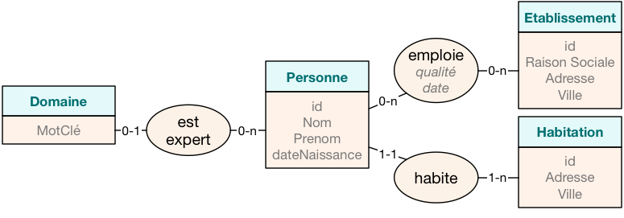
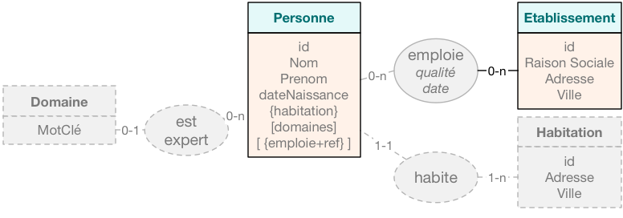

# MongoDB


------

Création : 22/12/2023 - F. SCHOSSIG
Modification : 09/12/2024 - F. SCHOSSIG

------


[TOC]


<div style="page-break-after:always"></div>
MongoDB, de « humongous », énorme, est un système de gestion de bases de données libre et gratuit développé depuis 2009. Il fait partie des bases de données NoSQL, de type orienté document. Il est flexible et peut fonctionner efficacement avec de grandes quantités de données. Il gère des collections de documents ressemblant à du JSON, stockés dans un format binaire, le BSON. Les collections sont l'équivalent des tables pour MySQL.


MongoDB est particulièrement bien adapté à la gestion de larges quantités de données non structurées ou semi-structurées.


## 1. Modélisation de documents


### 1.1. Collections et documents JSON

Les données d'une base NoSQL orientée documents s'organisent en **collections** et **documents** :

- une **collection** est un groupe de documents, similaire à une **table** dans le monde du SQL,
- un **document** contient un ensemble de clefs et valeurs, comme en JSON.

Le modèle d'un document JSON est très simple :

- tout est clef/valeur : **“clef” : “valeur”**
- un document est encapsulé dans des accolades **{...}**, pouvant contenir des listes de clefs/valeurs
- une valeur peut être :
    - un type scalaire (entier, nombre, texte, booléen, null),
    - des listes de valeurs **[...]**,
    - ou des documents imbriqués.

**MongoDB** ne gère aucun schéma pour les collections : les documents ne sont pas rigides. Ainsi, un document peut contenir une clef/valeur tandis que le suivant ne la contient pas. Par exemple, dans le cas des utilisateurs d’un site, l’adresse pourrait être connue pour certains et ignorée pour d’autres. Dans ce cas, contrairement au SQL où le champ serait vide, en NoSQL la clef/valeur peut tout simplement être ommise.

Il n'y a donc ni structure fixe, ni typage, éléments qui font la force des SGBDR. Il est ainsi difficile lors de l’interrogation de connaître a priori le contenu de la base de données.

**Exemple :** le document suivant peut donc être inséré dans notre collection `Cours`

```JSON
Cours (
{
  "cours" : "SQL",
  "chapitres" : ["Modèle relationnel", "LMD", "LDD"],
  "auteur" : {
     "nom" : "DROIT",
     "prenom" : "Arthur"
  }
},
{
  "cours" : "NoSQL",
  "chapitres" : ["Familles", "CAP", "Sharding", "Choix"],
  "auteur" : {
     "nom" : "TRAVERS",
     "prenom" : "Nicolas"
  }
} )
```


### 1.2. Traduire le modèle relationnel vers du JSON

Les données de départ sont dans une base relationnelle impliquant des liens entre tables. Pour transformer cette base en JSON, les liens sont à supprimer et les tables à fusionner. Cette opération s'appelle la `dénormalisation`.

**Exemple :** une personne peut avoir plusieurs domaine d’expertise, des emplois successifs, et une habitation. La base de données relationelle devient :



Pour intégrer une telle base de données avec une collection par entité ou association, le nombre de jointures pour les requêtes sur la base NoSQL risque de faire exploser le système. Des fusions sont alors nécessaires pour réduire le coût des requêtes.


### 1.3. Dénormalisation du schéma

Les étapes de modélisation suivantes vont permettre de produire des documents JSON répondant à la demande, tout en minimisant les problèmes de jointures et d’incohérences :

- **Des données fréquemment interrogées conjointement.**
    Par exemple, les requêtes demandent fréquemment le lieu d’habitation d’une personne.

    De fait, la jointure devient coûteuse. Accessoirement, cette information étant peu mise à jour, cela pose peu de problèmes. L’entité `Habitation` et l’association `habite` sont intégrées à l’entité `Personne`. `Habitation` devient un document imbriqué à l’intérieur de `Personne`, représenté par `"Habite" : {"Adresse" : "adresse", "Ville" : "ville"}`

- **Toutes les données d’une entité sont indépendantes.**
    Par exemple, les domaines d’expertise d’une personne, ils sont indépendants des domaines d’une autre personne.

    De fait, rapatrier les données de cette entité n’impacte aucune autre instance de `Personne`. Ainsi, la liste des domaines est importée dans `Personne` et représentée par `"Domaines" : [domaines]`

- **Une association avec des relations 1-n des deux côtés.**
    Pour l’entité `Etablissement`, une personne peut avoir plusieurs emplois et un employeur, plusieurs employés.

    De fait, une imbrication de l’employeur dans `Personne` peut avoir de gros impacts sur les mises à jour : tous les employés seraient à mettre à jour.

    Il est donc peu recommandé d’effectuer une fusion complète. Pour cela, seule l’association est imbriquée sous forme d’une liste de documents, intégrant les attributs `qualité` et `date`, ainsi qu’une référence vers l’employeur. Ainsi, les établissements deviennent : `"Emplois" : [{emplois+ref}]`

- **Même taux de mises à jour.**
    Dans le cas des emplois d’une personne, là également nous pourrions effectuer une fusion de l’association `emploie`. En effet, le taux de mises à jour des emplois est équivalent à celui de la `Personne`, de fait, sans incidence sur les problèmes de cohérence de données.

Au vu de ces critères, voici le schéma qui pourrait être obtenu par fusion successives :




Les listes sont représentées par des crochets et les imbrications par des accolades. Les établissements sont stockés dans une entité à part, mais que la référence est gardée dans une liste intégrée à l’entité `Personne`. Au format JSON, voici ci-après un exemple de données pour ce modèle. Les établissements sont référencés et des informations peuvent ne pas être renseignées.

```json
{
  "_id" : 1,
  "nom" : "Travers",
  "prenom" : "Nicolas",
  "domaines" : ["SGBD", "NoSQL", "RI", "XML"],
  "emplois" : [
    {"id_etablissement" : "100",
    	"qualité" : "Maître de Conférences",
        "date" : "01/09/2007"},
    {"id_etablissement" : "101",
    	"qualité" : "Vacataire",
        "date" : "01/09/2012"}
  ],
  "Habite" : {"adresse" : "292 rue Saint Martin",
  			  "ville" : "Paris"}
}
```


### 1.4. Application : dénormaliser la base de données pizzeria

Pour mémoire, le modèle relationnel de la pizzeria est le suivant :

- **Ingredients** (<u>idIngredient</u>, nomIngredient, prixUnitaireIngredient, #symboleUnite)
  - idIngredient : Clé primaire
  - symboleUnite : Clé étrangère en référence à symboleUnite de Unites

- **Unites** (<u>symboleUnite</u>, libelleUnite)
  - symboleUnite : Clé primaire

- **Compositions** (<u>idComposition</u>, #idPizza, #idIngredient, quantite)
  - idComposition : Clé primaire
  - idPizza : Clé étrangère en référence à idPizza de Pizzas
  - idIngredient : Clé étrangère en référence à idIngredient de Ingredients

- **Pizzas** (<u>idPizza</u>, nomPizza, prixVentePizza)
  - idPizza : Clé primaire

- **LignesCommande** (<u>idLigneCommande</u>, #idPizza, #idCommande, quantite)
  - idLigneCommande : Clé primaire
  - idPizza : Clé étrangère en référence à idPizza de Pizzas
  - idCommande : Clé étrangère en référence à idCommande de Commandes

- **Commandes** (<u>idCommande</u>, dateCommande, heureCommande, heureLivraison, #idEmploye)
  - idCommande : Clé primaire
  - idEmploye : Clé étrangère en référence à idEmploye de Employes

- **Employes** (<u>idEmploye</u>, nomEmploye, prenomEmploye, dateNaissance, salaireMensuel, dateEmbauche)
  - idEmploye : Clé primaire


## 2. Installation et configuration de MongoDB


Deux types de paquets sont disponibles :
- le paquet fourni par la communauté ubuntu selon la version d'Ubuntu installée :
    `sudo apt install mongodb`
- le paquet fourni par la communauté MongoDB, la version la plus récente :
    **[Install MongoDB Community Edition (MongoDB.com)](https://www.mongodb.com/docs/manual/tutorial/install-mongodb-on-ubuntu/#install-mongodb-community-edition)**.

Liens officiels :
- [Site officiel](http://www.mongodb.org/)
- [Documentation](https://www.mongodb.com/docs/manual/)


### 2.1. Installation de la version 7.0.x de MongoDB :

```bash
    ## Importer la clef publique
    sudo apt install gnupg wget
    wget -O- https://www.mongodb.org/static/pgp/server-8.0.asc | \
    	sudo gpg --dearmor -o /usr/share/keyrings/mongodb-server-8.0.gpg

    ## Créer un fichier list
	echo "deb [ arch=amd64,arm64 signed-by=/usr/share/keyrings/mongodb-server-8.0.gpg ] \
    	https://repo.mongodb.org/apt/ubuntu noble/mongodb-org/8.0 multiverse" | \
    	sudo tee /etc/apt/sources.list.d/mongodb-org-8.0.list

	## Installer
    sudo apt update
    sudo apt install -y apache2 php-fpm mongodb-org php-mongodb php-dev

    ## Lancer mongoDB :
    sudo systemctl start mongod
    mongosh
```

Si MongoDB ne se lance pas, vous pouvez essayer ces commandes :

```bash
    sudo rm /var/lib/mongodb/mongod.lock
    mongod --repair
    sudo systemctl start mongod
    mongosh
```


### 2.2. Configuration

Le fichier `/etc/mongodb.conf` contient la configuration de MongoDb. La version par défaut suffit à la plupart des utilisations.

Cependant, il peut être nécessaire de configurer l'accès à la base depuis le réseau.

**Attention :** cette opération peut compromettre la sécurité de votre système. Assurez-vous donc que vous savez ce que vous faites, entre autre que le pare-feu ou routeur soit convenablement configuré.

Par défaut, la connexion à MongoDB n'est possible que localement, sur `localhost`. Pour ouvrir la connexion depuis une autre machine, dans le fichier de configuration, il faut remplacer `127.0.0.1` par `0.0.0.0` sur la ligne `bind_ip`. L'option `bindIpAll: true` existe aussi.


## 3. Utilisation

En venant du monde des bases de données relationnelles et de la syntaxe SQL, l’apprentissage et l’usage du NoSQL est un peu déroutant au début. Voici donc un bref aperçu des notions propres à MongoDB suivi d’un condensé des commandes les plus couramment utilisées (et utiles) dans MongoDB.

L'**utilisation en shell** s'effectue grâce aux commandes lancées dans `mongosh`.

Des **interfaces graphiques** existent aussi, comme par exemple [MongoDB Compass](https://www.mongodb.com/products/tools/compass).


### 3.1. Connexion et navigation

```bash
    # afficher toutes les base de données
    show dbs

    # utiliser la base "madatabase"
    use madatabase

    # voir dans quelle base on est
    db

    # créer une collection
    db.createCollection('contact')

    # afficher les collections
    show collections

    # renommer une collection
    db.oldname.renameCollection("newname")

    # effacer la collection contacts
    db.contacts.drop()

    # effacer la base dans laquelle on est
    db.dropDatabase()
```


### 3.2. Insertion, sélection et tri

```bash
    # insertion
    db.contacts.insertOne({ firstname: 'Quentin', lastname: 'BUSUTTIL' })

    # sélection
    db.contacts.find()
    db.contacts.find({ firstname: 'Quentin' })
    db.contacts.find({ firstname: 'Quentin', lastname: 'BUSUTTIL' })

    # sélectionner les documents dont un array contient une valeur x
    db.contacts.find({ tags: 'business' })

    # sélectionner un élément parmi plusieurs
    db.contacts.find({ tags: { $in: ['business', 'french'] } })

    # sélectionner la combinaison de plusieurs
    db.contacts.find({ tags: { $all: ['business', 'french'] } })

    # sélectionner sur un array exact, ordre des éléments compris
    db.contacts.find({ tags: ['business', 'french'] })

    # trier la sélection
    #   1 = ordre croissant/alphabétique
    #   -1 = ordre décroissant/alphabétique inversé
    db.contacts.find().sort({ lastname: 1 })
```


### 3.3. Rechercher selon des propriétés d'un sous-document

```bash
    # Sur l'exemple de document :
    #   { nom: "Quentin",
    #	  agenda: {
    #		lundi: "programmation",
    #		mardi: "dev",
    #		mercredi: "code" } }
    # il est possible de chercher depuis son sous-document (guillemets autour de agenda.mardi)
    db.users.find({ 'agenda.mardi': 'dev' })

    # Recherche selon une correspondance exacte de sous-document
    db.users.find({ agenda: { lundi: "programmation", mardi: "dev", mercredi: "code" } })

	# Rechercher selon une condition ou une autre :
	# 	utiliser $or avec un tableau
	#	dont chaque élément est un objet littéral de sélection
	db.users.find({ $or: [{ _id:ObjectId("558d0b395fa02e7e218b4587") },
						  { _id:ObjectId("558d0b395fa02e7e218b4574") }] })

	# récupérer seulement certaines valeurs d'un document
	db.users.find({}, { _, fild1: 1, fild2: 0 })

	# rechercher tel que type vaut food ou snacks
	db.inventory.find({ type: { $in: ['food', 'snacks'] } })

	# sélectionner les documents comportant une valeur particulière
	db.users.find({ birthyear: { $exists: true } })

	# sélectionner les documents dont la valeur est différente de
	db.users.find({ birthyear: { $ne: 2000 } })

	# ne récupérer que le sous-document d'id x dans le document d'id z
	db.users.find({ _id: z, "contacts._id": x }, { "contacts.$._id" : 1 })
```


### 3.4. Mise à jour

```bash
    # L'utilisation de
    #	{ multi: true } permet de modifier plusieurs documents à la fois,
    # 	l'option { upsert: true } permet de créer le document s'il n'existe pas
    db.users.updateOne({ _id: x }, { $set: { "firstname": "Baboo" } })

	# mise à jour en remplaçant le document par un nouvel objet
	db.users.updateOne({ _id: 'azert' }, obj)

    # mise à jour d'un sous-document d'id y du docupent d'id x
    #	(dans un tableau de sous-documents appelé contacts),
    # {
    #   _id: 'x',
    #   name: 'azerty',
    #   contacts: [
    #     {
    #       _id: 'y',
    #       name: 'qwerty',
    #       email: 'qwerty@heymail.fr'
    #     }
    #   ]
    # }
    db.users.updateOne({ _id: x, "contacts._id": y }, { $set: { "contacts.$":myNewDocument } })

    # renommer une valeur
    db.users.updateOne({}, { $rename: { "ancien_nom": "nouveau_nom" } }, { multi: true })
```


### 3.4. Suppressions

```bash
	# effacer une valeur
	db.users.updateOne({ _id: x }, { $unset: { contacts: "" } })

    # effacer une valeur de tous les document d'une collection
    # 	correspond à ALTER TABLE users DROP COLUMN zorglub
    db.users.updateOne({}, { $unset: { zorglub: "" } }, { multi: true } )

	# retirer l'ami "yyy" du tableau "friends" de l'utilisateur "xxx"
	db.users.updateOne({ _id: xxx }, { $pull: { friends: yyy } })

    # retirer l'ami yyy qui s'est désinscrit de tous les utilisateurs
    db.users.updateOne({ friends: yyy }, { $pull: { friends: yyy } }, { multi: true })

    # effacer un document
    db.contacts.remove({ _id: ObjectId("55accc6c039c97c5db42f192") })

    # effacer tous les documents d'une collection
    db.contacts.remove({})

    # effacer un sous-document d'id y du doc d'id x (dans un tableau de sous-documents)
    db.users.updateOne({ _id: x }, { $pull: { contacts: { _id: y } } })

    # enlever le dernier ou le premier élément d'un tableau avec $pop
    # 	respectivement en lui passant les valeurs 1 ou -1
    db.users.updateOne({ _id: x }, { $pop: { contacts: -1 } })
```


## 4. PHP et NoSQL : travailler avec MongoDB


### 4.1. Configurer PHP

L'installation nécessite composer à installer comme indiqué sur la page suivante : [Download Composer](https://getcomposer.org/download/).

Une fois composer installé ainsi, l'exécutable composer.phar reste à déplacer au bon endroit de l'arborescence :
```bash
	sudo mv composer.phar /usr/local/bin/composer
```

Puis, les dépendances MongoDB de php sont à configurer :
```bash
    cd /var/www/html
    # ceci permet de modifier le contenu de /var/www/html sans passer par sudo,
    #     si l'utilisateur courant est dans le groupe adm
    sudo chown -R :adm .
    sudo chmod -R g+w .
    sudo chmod 2775 .
    composer require mongodb/mongodb
```


### 4.2. Un CRUD simple avec MongoDB


```php
    // ouvrir une connexion avec la base de donnée my_database
    use MongoDB\Client;
    $mongoClient = new Client("mongodb://localhost:27017");
    $database = $mongoClient->selectDatabase('my_database');
```

```php
    // insérer un document dans la collection my_collection
    $collection = $database->selectCollection('my_collection');
    $document = [
        'name' => 'John DOE',
        'email' => 'john.doe@example.com',
        'age' => 30
    ];
    $result = $collection->insertOne($document);
    printf("%d document(s) insérés", $result->getInsertedCount());
    var_dump($result->getInsertedId());
```

```php
	// chercher un document : afficher les contacts de plus de 25 ans
    $filter = ['age' => ['$gt' => 25]];
    $options = ['sort' => ['age' => -1]];
    $cursor = $collection->find($filter, $options);

    foreach ($cursor as $document) {
        echo $document['name'] . ', ' . $document['email'] . ', ' . $document['age'] . '<br>';
    }
```

```php
	// mettre à jour un document : modifier l'âge de John DOE
    $filter = ['name' => 'John DOE'];
    $update = ['$set' => ['age' => 31]];

    $result = $collection->updateOne($filter, $update);
```


```php
	// supprimer un document : supprimer les contacts de moins de 25 ans
    $filter = ['age' => ['$lt' => 25]];

    $result = $collection->deleteMany($filter);
```
